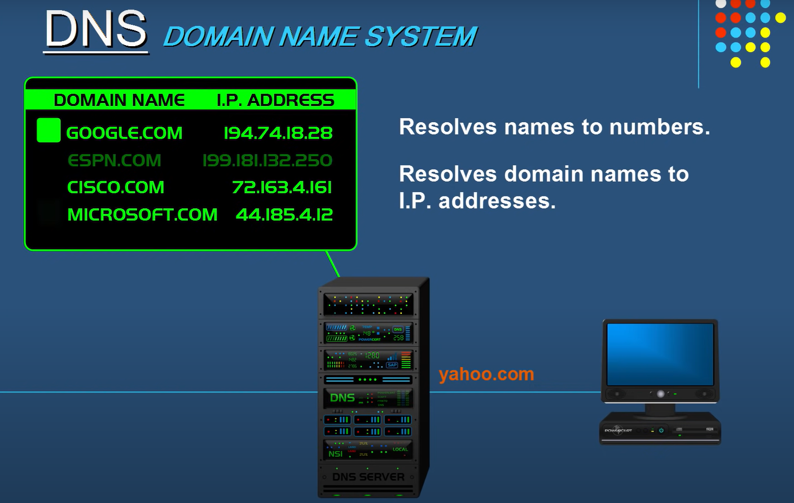
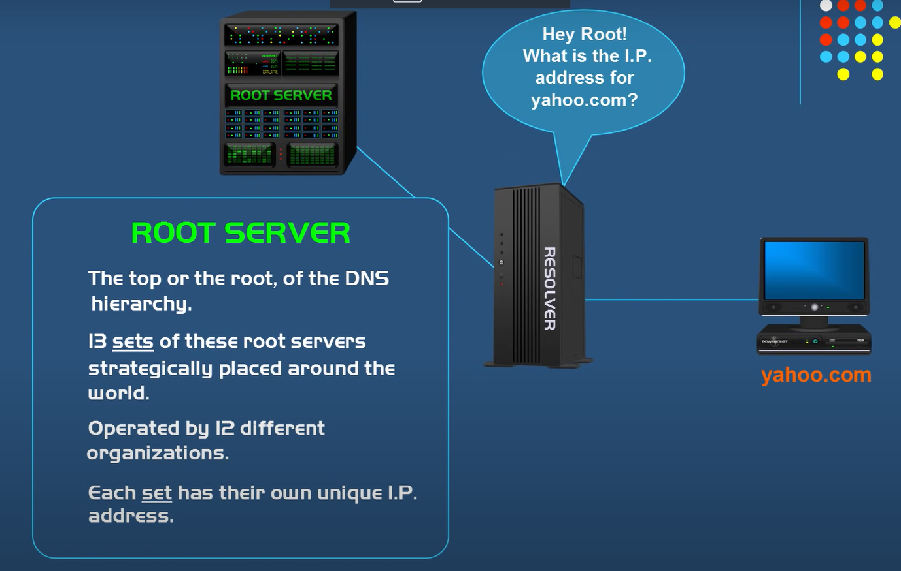
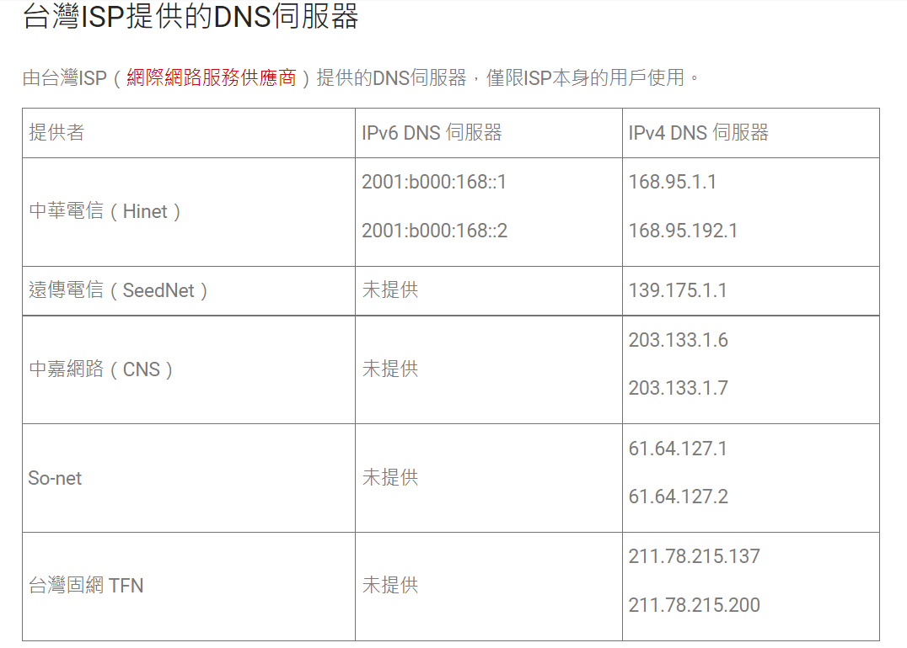
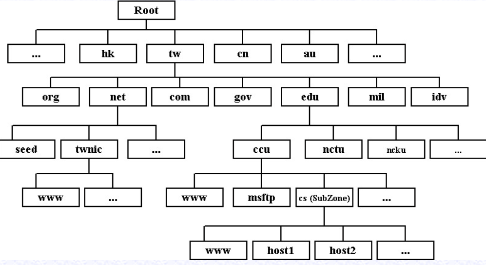

## DNS

DNS的全名是domain name system，目的在於雖然有網站名稱，但對於電腦來說實際上運作的是內部的IP，因此必須存在一種設計，在我們打上網站名稱後，可以自動幫忙找到IP的方法，也就是DNS的存在意義。

### 層級

上面是個大致的概念，不過在層級上，搜尋IP會分成好幾層：

第一層的搜尋在於每個人自己的電腦上，當在瀏覽器按下搜尋後，會先在自己電腦中的browser或是os的cache中進行尋找（這點個人覺得有待驗證，看能不能查到cache放在哪），如果沒有找到，再往上一個層級進行尋找，也就是ISP（internet service provider）提供的resolver進行尋找，如果在這邊也是沒有找到，那邊就會去訪問最頂層的root server，root server其實不會有所需要的內容，但是他知道所有TLD（top level domain）的位置在哪裡，因此他會回傳給你TLD的位置再去進行查詢，如果有查詢到的話，就會回傳相對應的IP位址出來：

最後resolver會有個cahce，他會將得到的名稱和IP對應儲存起來，以方便下次查詢時可以更快得到反應。

### DNS hijacking

DNS hijacking主要會發生在於像resolver要IP位址的階段，前面提到它是向ISP去要正確的IP位址，然而如果我們連線到了不可信任的ISP供應商，那個就有可能發生DNS hijacking的問題，比如我們希望連線到google.com，然而這個不可信任的ISP卻可以幫我們導到一個詐騙網站，那這樣就表示發生了DNS hijacking的問題。

> https://www.nss.com.tw/domain-name-system/
> https://www.youtube.com/watch?v=mpQZVYPuDGU
> http://dns-learning.twnic.net.tw/dns/02ArchDNS.html
> https://thevpn.guru/dns-hijacking-exposed-explained/