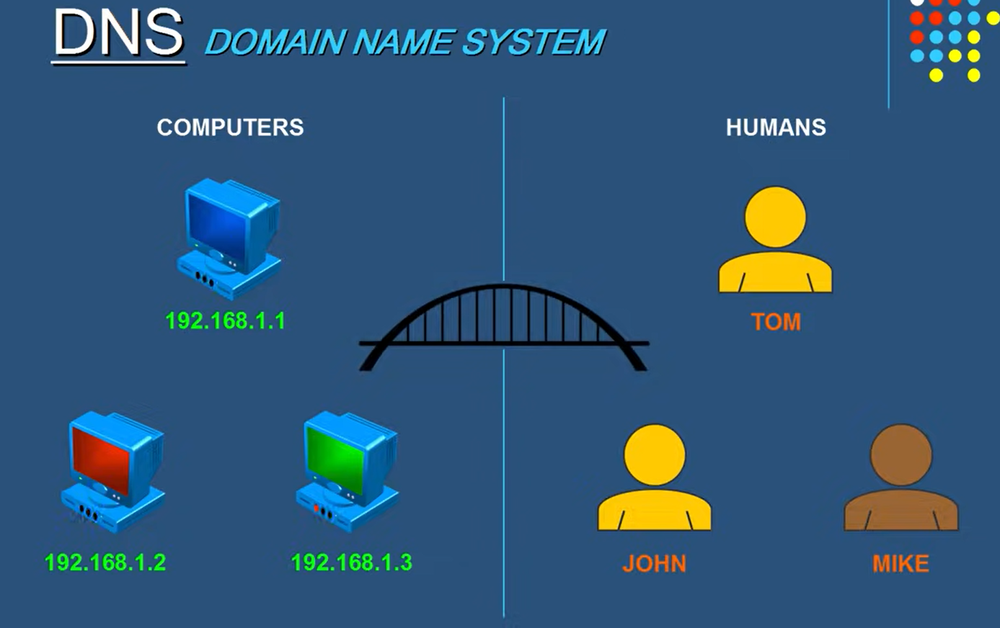
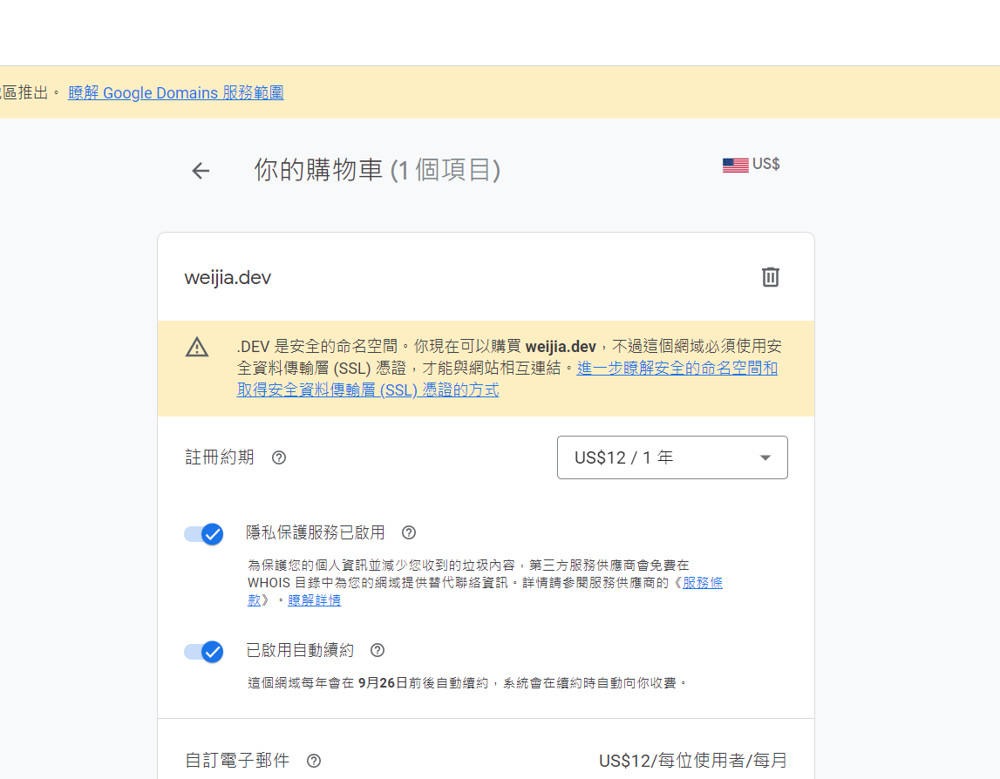

### domain name

在網際網路的世界當中，不同電腦之間的連線是依靠IP去運作，也就是必須知道對方的IP才有辦法找到別人的概念，然而記憶IP對我們來說極其不自然，相當不容易記憶，因此網站除了有自己的IP位址外，還會有網站的名稱，而人類記憶的會是這些網站的名稱，也就是所謂的domain name。

### web hosting

而web hosting的做用在於，當我們想要架設我們自己的網站服務時，除了自己維護一台server外，另一個選擇是web hosting，也就是網頁代管服務，目前最常見的大概就是GCP、AWS、Wordpress等.....，當有使用者想要連到我們的網站時，會連到的其實是別人的主機，我們只是付了一定額度的費用給了像是google、amazon等公司，讓他們來幫我們維護設備、cpu使用量、儲存空間等問題。

> https://progressbar.tw/posts/102