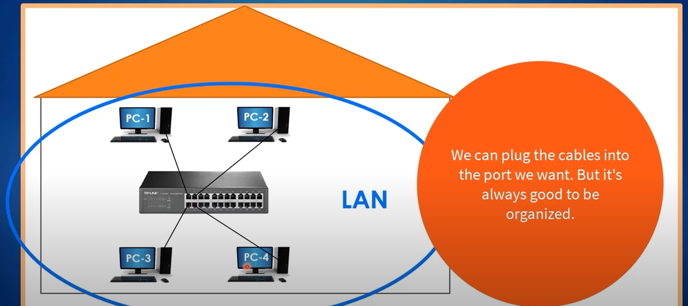
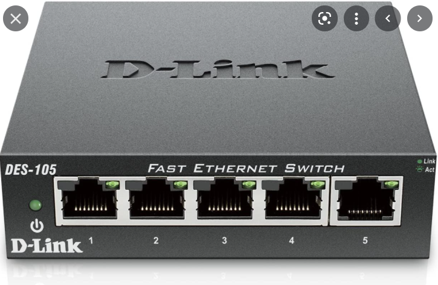
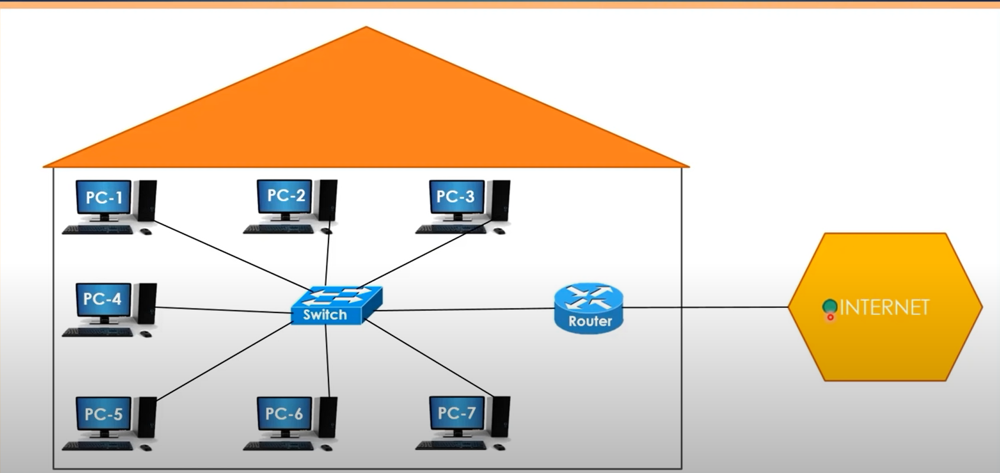
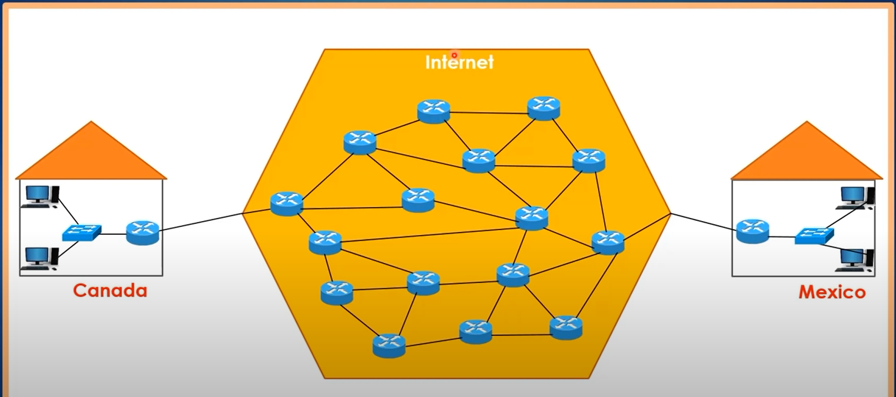
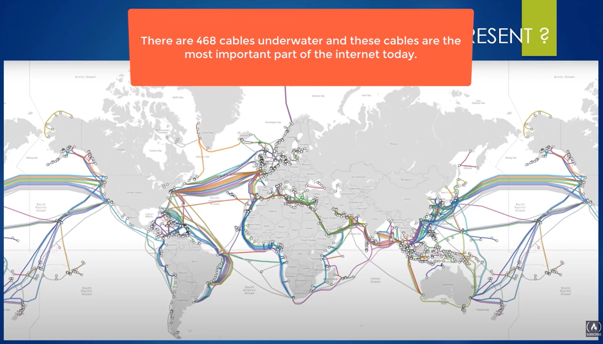
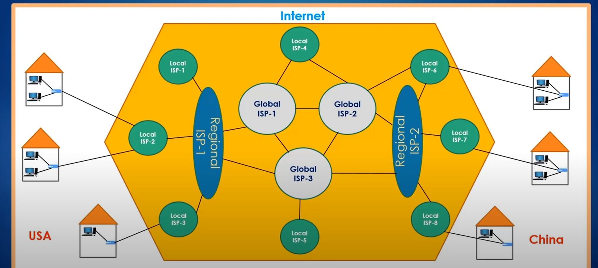
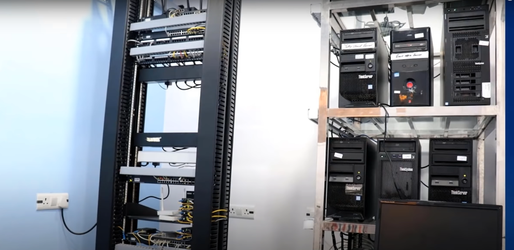

### LAN

在網際網路的世界中，其實是由各個小塊小塊的LAN而組成（組成一個大塊的WAN），而所謂的LAN就是Local Area Network，個人覺得所謂的區域網路，指得就是LAN，而下面那張房子的圖，所表示的就是一種LAN的概念，在家中如果要對網路進行連線，通常都會有一個switch去蒐集所有的裝置，像是我們的PC、平板、筆電、手機......，這個時候連到的都會是這個switch裝置，

接著如果要連到外部的網路，這個switch就會外接一條線連到router，這個router通常就是我們的ISP（internet service provider）進行提供，這樣的話才可以連到外部的網路。

### WAN

那如果想要藉由這樣的router，從我們當前的這個LAN，連到另一個人的設備時，這時就會出現下面一張圖，也就是透過各個router去幫我們導向正確的位址與地點，那這邊有個地方可以注意到是，初期在設計router有想過要不要有個中心router去決定說這個連線接著要連到哪裡，但這樣的設計會有個問題是，當中心router爆炸時，整個網路會因此癱瘓掉，也因此要把整個設計改掉，改成這種比較具有彈性的設計，這樣就算其中一條路線壞掉了，還是可以進行連線。

### ISP

接著提到的是ISP，在網路運作的過程中，如果今天各個router想要進行連線，這些router通常都是由ISP（internet service provider）去負責維運提供，也就是各個國家的ISP供應商去進行，

> https://www.youtube.com/watch?v=zN8YNNHcaZc